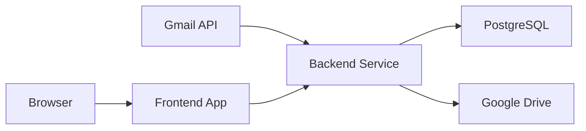

# {width=35 height=35} Thredox

Thredox is a modern email archiving system that seamlessly integrates with Gmail to provide powerful email management, search, and storage capabilities.

## 🌟 Features

- [x] **Gmail Integration**
  - OAuth 2.0 authentication
  - Real-time email syncing
  - Attachment handling with Google Drive

- [x] **Smart Archiving**
  - Intelligent email threading
  - Duplicate detection
  - Attachment deduplication

- [x] **Advanced Search**
  - Full-text search
  - Filter by date, sender, labels
  - Attachment content search

- [x] **Modern UI**
  - Responsive design
  - Dark/Light themes
  - Real-time updates

## 🏗️ Architecture



## 🚀 Quick Start

1. **Clone the Repository**
   ```bash
   git clone https://github.com/MrDanielD326/Thredox.git
   cd thredox
   ```

2. **Set Up Backend**
   ```bash
   cd thredox-backend
   npm install
   cp .env.example .env
   # Configure your .env file
   npm run dev
   ```

3. **Set Up Frontend**
   ```bash
   cd thredox-frontend
   npm install
   cp .env.example .env
   # Configure your .env file
   npm run dev
   ```

4. **Access the Application**
   - Frontend: http://localhost:5173
   - Backend API: http://localhost:3000

## 📚 Documentation

- [Backend Documentation](thredox-backend/README.md)
  - API endpoints
  - Database schema
  - Authentication flow

- [Frontend Documentation](thredox-frontend/README.md)
  - Component library
  - State management
  - Styling guide

- [API Documentation](docs/api.md)
- [Deployment Guide](docs/deployment.md)
- [Contributing Guide](docs/contributing.md)

## 🛠️ Tech Stack

### Backend
- Node + Express
- TypeScript
- PostgreSQL
- Gmail API
- Google Drive API

### Frontend
- React + Vite
- TypeScript
- TailwindCSS
- React Query

## 📊 System Requirements

### Minimum Requirements
- Node.js v16+
- PostgreSQL v12+
- 2GB RAM
- 10GB Storage

### Recommended
- Node.js v18+
- PostgreSQL v14+
- 4GB RAM
- 20GB+ Storage

## 🤝 Contributing

We welcome contributions! Please see our [Contributing Guide](docs/contributing.md) for details.

1. Fork the repository
2. Create your feature branch
3. Commit your changes
4. Push to the branch
5. Open a pull request

## 📝 License

This project is licensed under the MIT License - see the [LICENSE](LICENSE) file for details.

## 🙏 Acknowledgments

- [Gmail API Documentation](https://developers.google.com/gmail/api)
- [Google Drive API](https://developers.google.com/drive)
- [React Documentation](https://react.dev)
- [Express.js](https://expressjs.com)

---

## 📬 Contact Me

[](mailto:daniel.elohi326@gmail.com) [](https://www.linkedin.com/in/danield326) [](https://github.com/MrDanielD326)


---
